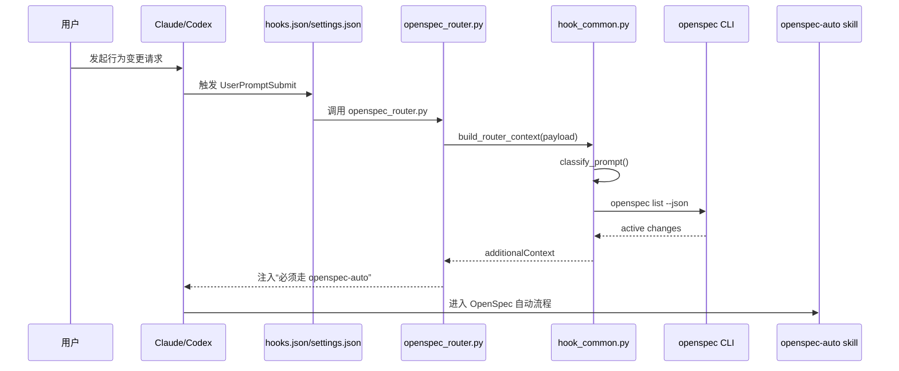
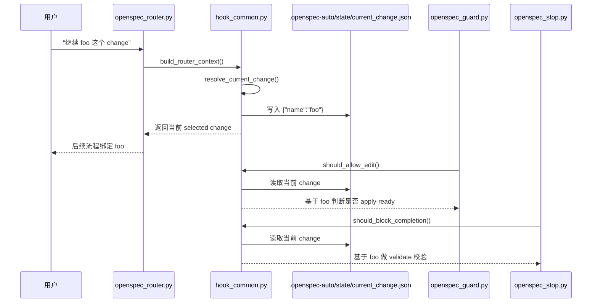
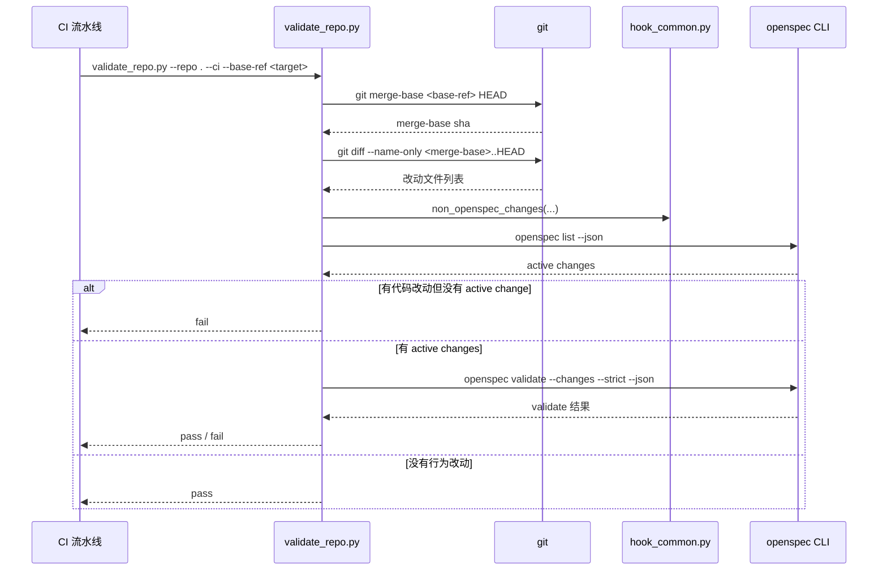
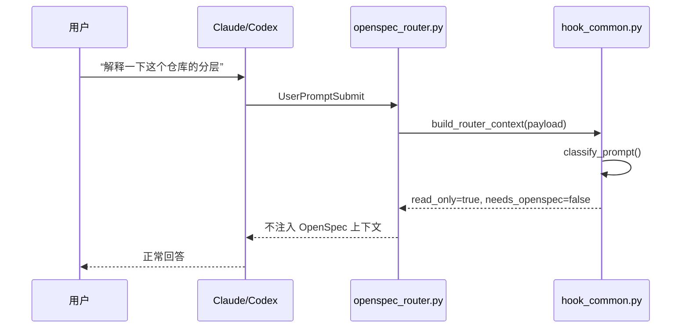
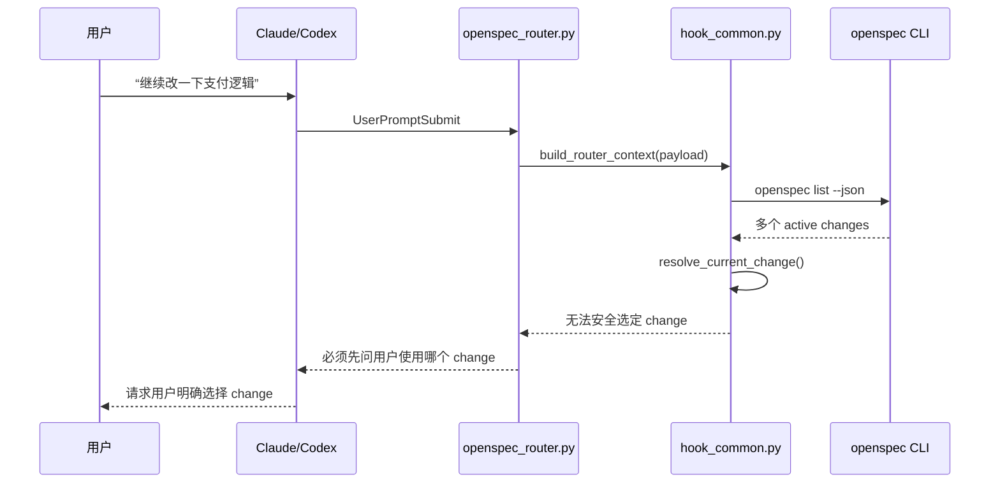
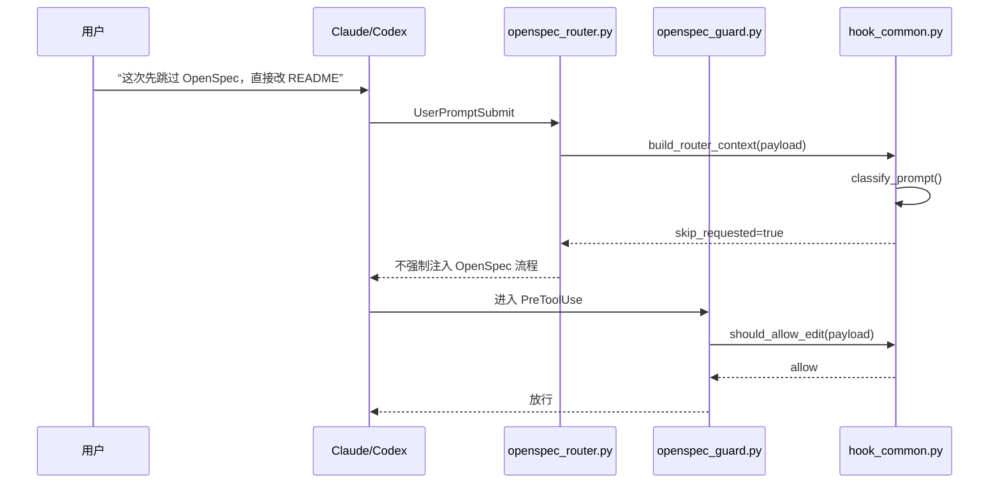

# OpenSpec Auto Bootstrap

一个独立可复用的 bootstrap 目录，用来把 **OpenSpec-first 工作流** 自动接入到 **Codex** 和 **Claude Code**。

目标是让你在业务仓库里做到下面这件事：

- 用户只说“实现 X / 修复 Y / 修改 Z”
- 不需要用户手动输入 `openspec ...`
- 不需要用户手动输入 `/opsx:*`
- Agent 自动进入 OpenSpec 流程：
  - 检查 active changes
  - 选择或创建 change
  - 生成 proposal / design / specs / tasks
  - 在 apply-ready 后再改业务代码
  - 在收尾时做 validate 和常规测试

这套 bootstrap 采用的是：

- **仓库内规则**：`AGENTS.md`、`CLAUDE.md`
- **仓库内技能**：`.claude/skills/openspec-auto`、`.agents/skills/openspec-auto`
- **仓库内 hooks**：Claude Code / Codex 分别挂钩
- **仓库内工具脚本**：`tools/openspec/*`
- **外部安装器**：发布后的 `openspec-auto` 单文件二进制

这样做的好处是：

- 不依赖某台机器里“碰巧正确”的全局 prompt
- 规则可以跟仓库一起版本化、审查、回滚
- 同一套仓库配置可以给团队成员统一复用
- 更适合生产环境和多人协作

---

## 1. 适用范围

适合接入 OpenSpec 的请求类型：

- 新功能开发
- Bug 修复
- 会改变行为的重构
- API / DTO / DB / migration / 前端行为修改
- 会改变运行时行为的配置修改

不应该强制走 OpenSpec 的请求类型：

- 纯解释、纯问答
- 只读代码审查
- 纯文档修改
- 与仓库运行时行为无关的运维说明类问题

---

## 2. 目录结构

```text
openspec-auto-bootstrap/
├── README.md                                # 说明文档：安装方法、运行流程、CI 接入方式
├── go.mod                                   # Go module 定义
├── cmd/
│   └── openspec-auto/                       # CLI 入口：install / uninstall / doctor / version
├── internal/
│   ├── bootstrap/                           # 安装、卸载、doctor 的核心实现
│   └── cli/                                 # 子命令解析与输出
├── install.sh                               # 兼容入口脚本
├── uninstall.sh                             # 兼容入口脚本
├── doctor.sh                                # 兼容入口脚本
├── .gitignore                               # 忽略 .DS_Store / __pycache__ / *.pyc
├── docs/                                    # 文档产物目录
│   └── diagrams/                            # README 里的时序图导出目录（SVG + PNG）
├── templates/                               # 模板目录：这里的 repo/ 就是最终安装源
│   └── repo/                                # 目标业务仓库模板根目录
│       ├── AGENTS.md                        # 仓库级 OpenSpec-first 规则主入口
│       ├── CLAUDE.md                        # Claude 入口，负责把 Claude 引到 AGENTS.md
│       ├── .claude/                         # Claude Code 专用配置
│       │   ├── settings.json                # Claude hooks 注册表
│       │   ├── hooks/                       # Claude 四类 hook 的脚本目录
│       │   │   ├── openspec_context.py      # SessionStart：注入当前 OpenSpec 状态
│       │   │   ├── openspec_router.py       # UserPromptSubmit：判断请求是否要走 OpenSpec
│       │   │   ├── openspec_guard.py        # PreToolUse：真正写代码前守门
│       │   │   └── openspec_stop.py         # Stop：模型宣称完成前收口校验
│       │   └── skills/
│       │       └── openspec-auto/
│       │           └── SKILL.md             # Claude 项目级 skill，定义自动 OpenSpec 流程
│       ├── .codex/                          # Codex 专用配置
│       │   ├── hooks.json                   # Codex hooks 注册表
│       │   ├── config.toml.append           # Codex 用户配置参考片段，核心是 codex_hooks=true
│       │   ├── prompts/
│       │   │   └── openspec-auto.md         # Codex 提示词兜底，不是主链路核心
│       │   └── hooks/                       # Codex 四类 hook 的脚本目录
│       │       ├── openspec_context.py      # Codex 版 SessionStart hook
│       │       ├── openspec_router.py       # Codex 版 UserPromptSubmit hook
│       │       ├── openspec_guard.py        # Codex 版 PreToolUse hook
│       │       └── openspec_stop.py         # Codex 版 Stop hook
│       ├── .agents/                         # Codex/Agents 风格的 skill 目录
│       │   └── skills/
│       │       └── openspec-auto/
│       │           └── SKILL.md             # Codex 使用的项目级 skill
│       └── tools/
│           └── openspec/                    # 安装后在目标仓库里运行的公共工具目录
│               ├── env.sh                   # shell 公共函数：解析 node / openspec / repo root
│               ├── healthcheck.sh           # 目标仓库健康检查脚本
│               ├── hook_common.py           # 所有 hook 的核心逻辑单一来源
│               ├── classify_request.py      # classify_prompt 的命令行包装器
│               ├── resolve_change.py        # 选择 active change 的命令行包装器
│               ├── validate_repo.py         # CI / 仓库最终门禁校验
│               └── sync_templates.sh        # 模板维护脚本，主要同步执行权限
└── tests/                                   # bootstrap 自己的回归测试
    ├── __init__.py                          # Python unittest 包标记
    ├── test_cli_binary.py                   # Go CLI 的安装/卸载/doctor 回归测试
    ├── test_hook_common.py                  # 多 active changes / current change 状态回归测试
    ├── test_repo_hygiene.py                 # 仓库文本内容的绝对路径泄漏检查
    ├── test_validate_repo.py                # CI diff / base-ref 校验回归测试
    └── test_install_script.py               # 旧 shell 安装入口的兼容回归测试
```

设计原则：

- `templates/repo/` 里的内容就是最终要落到业务仓库里的文件
- `openspec-auto` CLI 负责安装、卸载、体检；根目录 shell 脚本仅保留兼容入口
- 仓库落地后，即使不保留这个 bootstrap 目录，仓库本身仍然可以工作

### 2.1 安装后目标业务仓库会生成哪些文件

下面这棵树不是 bootstrap 仓库本身，而是 `openspec-auto install` 落到目标业务仓库后的典型结果：

```text
your-repo/
├── AGENTS.md                                # [模板注入] OpenSpec-first 规则主入口
├── CLAUDE.md                                # [模板注入] Claude 入口，并补 @AGENTS.md
├── .claude/                                 # [模板拷贝] Claude 运行层
│   ├── settings.json                        # Claude hooks 注册表
│   ├── hooks/
│   │   ├── openspec_context.py              # Claude SessionStart hook
│   │   ├── openspec_router.py               # Claude UserPromptSubmit hook
│   │   ├── openspec_guard.py                # Claude PreToolUse hook
│   │   └── openspec_stop.py                 # Claude Stop hook
│   └── skills/
│       └── openspec-auto/
│           └── SKILL.md                     # Claude 项目级自动 OpenSpec skill
├── .agents/                                 # [模板拷贝] Codex/Agents 风格 skill 层
│   └── skills/
│       └── openspec-auto/
│           └── SKILL.md                     # Codex 使用的 skill
├── .codex/                                  # [模板拷贝] Codex 运行层
│   ├── hooks.json                           # Codex hooks 注册表
│   ├── config.toml.append                   # Codex 用户配置参考片段
│   ├── prompts/
│   │   └── openspec-auto.md                 # Codex 提示词 fallback
│   └── hooks/
│       ├── openspec_context.py              # Codex SessionStart hook
│       ├── openspec_router.py               # Codex UserPromptSubmit hook
│       ├── openspec_guard.py                # Codex PreToolUse hook
│       └── openspec_stop.py                 # Codex Stop hook
├── tools/                                   # [模板拷贝] 目标仓库内工具层
│   └── openspec/
│       ├── env.sh                           # shell 公共函数库
│       ├── healthcheck.sh                   # 仓库健康检查脚本
│       ├── hook_common.py                   # hook 核心逻辑
│       ├── classify_request.py              # 请求分类 CLI 包装器
│       ├── resolve_change.py                # change 选择 CLI 包装器
│       ├── validate_repo.py                 # CI / 仓库校验入口
│       └── sync_templates.sh                # 模板维护脚本
├── openspec/                                # [OpenSpec CLI 初始化] 标准 OpenSpec 资产
│   ├── specs/                               # OpenSpec 标准 specs 目录
│   ├── changes/                             # OpenSpec 标准 changes 目录
│   └── ...                                  # 其他 OpenSpec 标准结构
├── .openspec-auto-backup/                   # [安装时生成] 每次安装前的备份目录
│   └── <UTC 时间戳>/                        # 某次安装对应的备份快照
└── .openspec-auto/                          # [运行时生成] openspec-auto 的本地状态目录
    └── state/
        └── current_change.json              # 当前选中的 change；只有运行时才会惰性写入
```

补充说明：

- `openspec/` 目录来自 `openspec init --tools none`，不是模板直接拷贝出来的
- `.openspec-auto-backup/` 是安装时生成的备份目录
- `.openspec-auto/state/current_change.json` 是 hook 运行时惰性写入的状态文件
- `~/.codex/config.toml` 不在业务仓库内，但安装时默认会尝试开启 `codex_hooks = true`

### 2.2 这些文件之间的关系

从职责分层看，这些文件可以分成 6 层：

1. 生命周期层：
   - `openspec-auto install`
   - `openspec-auto uninstall`
   - `openspec-auto doctor`
   负责安装、卸载、体检，不参与每轮请求的运行时判断。

2. 规则层：
   - `AGENTS.md`
   - `CLAUDE.md`
   - `.claude/skills/openspec-auto/SKILL.md`
   - `.agents/skills/openspec-auto/SKILL.md`
   - `.codex/prompts/openspec-auto.md`
   负责告诉模型“什么请求要走 OpenSpec、默认流程怎么走”。

3. 触发层：
   - `.claude/settings.json`
   - `.codex/hooks.json`
   负责在 `SessionStart`、`UserPromptSubmit`、`PreToolUse`、`Stop` 等事件上挂 hook。

4. 平台适配层：
   - `.claude/hooks/*.py`
   - `.codex/hooks/*.py`
   这些脚本本身很薄，只负责读取 hook payload，然后转调 `tools/openspec/hook_common.py`。

5. 核心决策层：
   - `tools/openspec/hook_common.py`
   这是运行时真正的大脑，负责请求分类、active change 选择、`current change` 状态维护、编辑前守门、完成态守门。

6. 校验层：
   - `tools/openspec/env.sh`
   - `tools/openspec/healthcheck.sh`
   - `tools/openspec/validate_repo.py`
   负责环境正确、仓库状态正确、CI 最终门禁。

### 2.3 主调用链

典型链路可以概括成下面这条：

```text
用户发请求
  -> hooks.json / settings.json 在对应事件上触发 hook
  -> .claude/hooks/*.py 或 .codex/hooks/*.py 读取 payload
  -> tools/openspec/hook_common.py 做真正判断
  -> hook_common.py 调用 openspec CLI + git
  -> 把 allow / deny / additionalContext / stopReason 返回给 Claude 或 Codex
  -> 模型再结合 AGENTS.md + openspec-auto skill 执行
```

下面给出真正的时序图版本，方便一眼看清“谁触发谁、谁调用谁”。

#### 2.3.1 主请求链路时序图



#### 2.3.2 current change 状态流时序图



#### 2.3.3 CI 门禁时序图



上面这些时序图如果导出为图片，统一放在仓库内的：

```text
docs/diagrams/
```

不会再直接丢到项目根目录。

其中最关键的三条子链是：

1. 路由链：
   - `UserPromptSubmit`
   - `openspec_router.py`
   - `hook_common.build_router_context()`
   负责判断这次请求是不是“会改行为”的请求。

2. 守门链：
   - `PreToolUse`
   - `openspec_guard.py`
   - `hook_common.should_allow_edit()`
   负责确保 current change 已经确定，且 change 已经 apply-ready。

3. 收口链：
   - `Stop`
   - `openspec_stop.py`
   - `hook_common.should_block_completion()`
   负责在模型准备宣称“已完成”前，检查变更和 `openspec validate` 是否通过。

### 2.4 三个边界场景

下面这三条是最容易被问到的边界流程，也是判断这套自动化是不是“既严格又不过度”的关键。

#### 场景 A：只读问题为什么不会强行进入 OpenSpec

示例请求：

```text
解释一下这个仓库的分层
```

链路是：

```text
用户发只读问题
  -> UserPromptSubmit
  -> openspec_router.py
  -> hook_common.classify_prompt()
  -> 判断为 read_only=true / needs_openspec=false
  -> 不注入额外 OpenSpec 上下文
  -> 模型正常回答
```

设计意图：

- OpenSpec-first 的目标是管住“行为变化”
- 不是把所有问答、解释、审查都强行拖进规格流程



#### 场景 B：为什么多个 active changes 时一定会先要求选 change

示例场景：

- 当前仓库里同时存在 `fix-payment-callback-duplicate-insert`
- 以及 `refactor-order-reconciliation`
- 用户只说“继续改一下支付逻辑”

链路是：

```text
用户发行为变更请求
  -> UserPromptSubmit
  -> openspec_router.py
  -> hook_common.openspec_list()
  -> 发现有多个 active changes
  -> 如果 prompt 里没有明确命中某个 change
  -> 返回“必须先让用户明确选择 change”
  -> 后续 PreToolUse 不会放行写代码
```

设计意图：

- 企业场景里不能让模型在多个 plausible changes 之间“猜一个”
- change 一旦猜错，后续 guard、validate、任务对齐都会串线



#### 场景 C：用户明确说“跳过 OpenSpec”时为什么会放行

示例请求：

```text
这次先跳过 OpenSpec，直接改 README
```

链路是：

```text
用户明确要求 skip openspec
  -> UserPromptSubmit
  -> classify_prompt() 命中 skip_requested=true
  -> Router 不再强制注入 OpenSpec 流程
  -> 如果后续进入 PreToolUse
  -> should_allow_edit() 优先识别 skip_requested
  -> 返回 allow
```

设计意图：

- 仓库默认是 OpenSpec-first，不是 OpenSpec-only
- 用户的明确指令优先级高于默认流程
- 但这种绕过应该是显式行为，不允许系统静默绕过



---

## 3. 环境要求

最少要求：

- `python3`
- `node >= 20.19.0`
- `openspec`
- `git`

推荐同时具备：

- `claude`
- `codex`

你当前本地已经确认是 `node v24.6.0`，满足 OpenSpec / Codex / Claude Code 这一层的运行要求。

注意两点：

1. **不要只看你装了什么版本，要看当前 shell 实际跑的是哪个 `node`**
   - 之前你机器上出现过“安装的是新版，但执行时落到了旧版 `node v13.14.0`”的情况
   - 这会导致 `openspec` 和 `codex` 直接报现代语法错误

2. **bootstrap 默认关闭 OpenSpec telemetry**
   - 脚本会设置 `OPENSPEC_TELEMETRY=0`
   - 这是为了减少离线环境、受限网络、CI 环境里的噪音和不确定性

---

## 4. 快速安装

先构建二进制：

```bash
go build -o ./bin/openspec-auto ./cmd/openspec-auto
```

如果你希望在任何目录直接使用，可以把它放到常用的可执行目录：

```bash
cp ./bin/openspec-auto /usr/local/bin/openspec-auto
cp ./bin/openspec-auto "$HOME/go/bin/openspec-auto"
```

然后把它接到业务仓库：

```bash
openspec-auto install /absolute/path/to/your-repo
```

安装完成后，直接在目标仓库里打开 Claude Code 或 Codex，然后正常说需求即可：

- `实现订单超时自动取消`
- `修复支付回调重复入库`
- `把会员试用逻辑改成 7 天`

你不需要手动输入：

- `openspec ...`
- `/opsx:propose ...`
- `/opsx:apply ...`

---

## 5. 安装脚本会做什么

`openspec-auto install` 会按下面顺序工作。

### 5.1 校验本机环境

会检查：

- `python3`
- `node`
- `openspec`
- `node` 版本是否 `>= 20.19.0`

### 5.2 初始化仓库级 OpenSpec 目录

如果目标仓库还没有 `openspec/`，脚本会运行：

```bash
openspec init --tools none /path/to/repo
```

为什么用 `--tools none`：

- 我们只要 OpenSpec 的仓库结构
- 不想让 OpenSpec CLI 自己去改你的全局 Codex / Claude 配置
- 真正的 Claude/Codex 集成由本 bootstrap 自己接管

这一步会创建最基础的：

- `openspec/specs/`
- `openspec/changes/`
- OpenSpec 配置文件

### 5.3 安装仓库内规则

脚本会把一个 **managed block** 注入到：

- `AGENTS.md`
- `CLAUDE.md`

其中：

- `AGENTS.md` 是真正的流程约束源
- `CLAUDE.md` 负责把 Claude 引到 `@AGENTS.md`

### 5.4 安装技能

会安装两份 `openspec-auto`：

- `.claude/skills/openspec-auto/SKILL.md`
- `.agents/skills/openspec-auto/SKILL.md`

原因：

- Claude Code 走 `.claude/skills`
- Codex 官方技能目录走 `.agents/skills`

### 5.5 安装 hooks

会安装：

- Claude hooks：`.claude/hooks/*.py`
- Codex hooks：`.codex/hooks/*.py`
- Claude hook 配置：`.claude/settings.json`
- Codex hook 配置：`.codex/hooks.json`

### 5.6 安装仓库内工具脚本

会安装到：

- `tools/openspec/env.sh`
- `tools/openspec/healthcheck.sh`
- `tools/openspec/hook_common.py`
- `tools/openspec/classify_request.py`
- `tools/openspec/resolve_change.py`
- `tools/openspec/validate_repo.py`
- `tools/openspec/sync_templates.sh`

### 5.7 修补用户级 Codex 配置

默认会尝试把下面这项确保写进 `~/.codex/config.toml`：

```toml
[features]
codex_hooks = true
```

这是为了让 Codex 的 repo-local hooks 真正生效。

如果你不想自动修改用户配置，可以安装时加：

```bash
--skip-codex-user-config
```

---

## 6. 安装参数

### 6.1 `--force`

```bash
openspec-auto install --force /path/to/repo
```

含义：

- 允许覆盖 managed 文件
- 覆盖前会先做备份

### 6.2 `--skip-codex-user-config`

```bash
openspec-auto install --skip-codex-user-config /path/to/repo
```

含义：

- 不修改 `~/.codex/config.toml`
- 适合你自己要手工管理 Codex 全局配置的场景

> **注意**：使用此选项时，体检（healthcheck）仍会通过，但会输出警告。Codex 的 repo-local hooks **不会生效**，直到你手工在 `~/.codex/config.toml` 的 `[features]` 下添加 `codex_hooks = true`。

### 6.3 `--skip-openspec-init`

```bash
openspec-auto install --skip-openspec-init /path/to/repo
```

含义：

- 不执行 `openspec init --tools none`
- 适合仓库里已经有完整 OpenSpec 目录的场景

---

## 7. 备份策略

每次安装都会在目标仓库下创建备份目录：

```text
.openspec-auto-backup/<UTC 时间戳>/
```

用途：

- 回滚被覆盖的配置文件
- 审计本次安装改了什么

这也是为什么生产环境建议所有接入都通过 `openspec-auto install`，而不是人工拷文件。

---

## 8. 日常使用方式

安装完成后，日常使用分成两种。

### 8.1 正常业务开发

直接说业务需求：

- `实现短信登录`
- `修复库存扣减并发问题`
- `把导出接口改成异步任务`

期望行为：

1. Router hook 判断这是“会改行为”的请求
2. 注入额外上下文，提醒 agent 走 `openspec-auto`
3. `openspec-auto` skill 检查 active changes
4. 没有 change 就自动创建
5. 补齐 proposal / design / specs / tasks
6. 到 apply-ready 后再改业务代码
7. 最后跑 `openspec validate`

### 8.2 只读问题

例如：

- `解释一下这个仓库的分层`
- `review 这段 SQL 有没有问题`
- `总结一下订单状态机`

期望行为：

- 不强行进入 OpenSpec
- 正常回答或只读审查

---

## 9. 自动触发机制

这是整个方案的核心。

### 9.1 SessionStart

作用：

- 会话开始时注入 OpenSpec 状态上下文
- 告诉 agent 当前仓库启用了 OpenSpec-first
- 摘要 active changes

收益：

- 减少每轮都重新判断仓库是否启用 OpenSpec
- 降低上下文漂移

### 9.2 UserPromptSubmit

作用：

- 在用户每次发消息时做请求分类
- 判断是不是“会改代码 / 改行为”的请求

如果判定需要 OpenSpec：

- 注入额外上下文，明确要求使用 `openspec-auto`
- 如果仓库已有 active change，尽量建议继续那个 change
- 如果有多个可能 change，则提示 agent 必须问用户，不允许乱选

### 9.3 PreToolUse

作用：

- 在真正执行编辑前做一次守门

Claude Code 侧：

- 会尝试拦 `Edit | Write | MultiEdit | Bash`

Codex 侧：

- 同样拦截 `Edit | Write | MultiEdit | Bash`，与 Claude Code 保持一致

### 9.4 Stop

作用：

- 当 agent 准备收尾、给出“已完成”之类的答复时
- 做最后一层校验

校验内容：

- 有没有 active change
- 有没有代码修改落在 `openspec/` 外面但没有 change
- 当前 change 是否 `openspec validate` 通过

这个 hook 不是每轮都拦，它主要针对“要宣称完成”时的收口阶段。

---

## 10. `openspec-auto` skill 做什么

这份 skill 的职责不是替代 OpenSpec，而是把 OpenSpec 串起来。

它的默认流程是：

1. `openspec list --json`
2. 解析当前 active changes
3. 选择 change：
   - 用户明确指定 change：直接用
   - 只有一个明显匹配的 active change：继续
   - 多个可能 change：必须问用户
   - 没有 active change：自动创建
4. `openspec new change "<name>"`
5. `openspec status --change "<name>" --json`
6. 对每个 `ready` 的 artifact：
   - `openspec instructions <artifact-id> --change "<name>" --json`
   - 生成对应 artifact 文件
7. 当所有 `applyRequires` 都完成后，进入业务代码修改
8. 收尾时运行：
   - `openspec validate "<name>" --type change --strict --json --no-interactive`
   - 仓库自己的测试和校验

这个 skill 的设计重点是：

- 用户不需要记命令
- Agent 不要把“你先运行 openspec xxx”甩回给用户

---

## 11. 生产环境落地建议

这部分是最重要的。

### 11.1 不要只依赖 prompt

生产级必须至少有这三层：

1. `AGENTS.md / CLAUDE.md`
2. `skills`
3. `hooks + CI`

缺任何一层，都容易变成“偶尔遵守、偶尔漂移”。

### 11.2 一定要加 CI 门禁

推荐在 CI 里加至少一条：

```bash
python3 tools/openspec/validate_repo.py --repo . --ci --base-ref main
```

建议同时再加：

```bash
OPENSPEC_TELEMETRY=0 openspec validate --changes --strict --json --no-interactive
```

推荐门禁语义：

- 如果 `openspec/` 外有代码修改，但没有 active change：失败
- 如果 active change 校验失败：失败
- 如果只改文档，没有行为变化：通过

说明：

- `--base-ref` 应该指向 PR / MR 的目标分支
- 如果 CI 环境已经提供 `GITHUB_BASE_REF`、`CI_MERGE_REQUEST_TARGET_BRANCH_NAME`、`BITBUCKET_PR_DESTINATION_BRANCH`、`CHANGE_TARGET` 等变量，可以不显式传 `--base-ref`

### 11.3 把 bootstrap 当成“标准接入器”

团队推广时，不要让每个人自己配。

正确方式：

1. 统一用本 bootstrap 安装
2. 所有接入都走 PR
3. 让 `AGENTS.md` / hooks / skills 一起纳入版本控制
4. 让 CI 去兜底

### 11.4 固定 Node 和 OpenSpec 版本

建议至少固定：

- Node LTS
- OpenSpec CLI 版本
- Claude / Codex 版本范围

可选方式：

- `mise`
- `asdf`
- `volta`
- `devcontainer`

目标不是“最新”，而是“团队一致”。

### 11.5 建议把 telemetry 在自动化链路里关掉

在下面这些场景里，建议默认关：

- CI
- 受限网络
- 沙箱环境
- 企业内网

本模板已经默认通过环境变量处理：

```bash
OPENSPEC_TELEMETRY=0
```

---

## 12. Codex 与 Claude Code 的差异

### Claude Code

强项：

- hooks 能力相对更成熟
- `CLAUDE.md` / skills / hooks 配合度更高
- 可以更强地拦截写入前动作

因此：

- Claude Code 是这套方案里“强约束”的主场

### Codex

强项：

- `AGENTS.md`
- `.agents/skills`
- repo-local hook 机制

Codex 的 PreToolUse 现在同样拦截 `Edit | Write | MultiEdit | Bash`，与 Claude Code 保持一致。两个平台共享同一套守门逻辑。

Codex 侧同样多层防御：
  - `AGENTS.md` 规则层
  - `.agents/skills/openspec-auto` 技能引导
  - `PreToolUse` / `Stop` hook 运行时守门
  - CI 门禁兜底

---

## 13. 体检命令

### 13.1 体检 bootstrap 自身

```bash
openspec-auto doctor
```

### 13.2 体检某个仓库

```bash
openspec-auto doctor /absolute/path/to/repo
```

实际会调用仓库里的：

```bash
tools/openspec/healthcheck.sh
```

会检查：

- `python3`
- `node`
- `openspec`
- OpenSpec CLI 在当前仓库里是否能正常执行
- 仓库级 `validate_repo.py --smoke`

---

## 14. 卸载

卸载命令：

```bash
openspec-auto uninstall /absolute/path/to/repo
```

会移除：

- managed block
- hooks
- skills
- repo-local OpenSpec auto 工具脚本
- `~/.codex/config.toml` 里 bootstrap 插入的标记行

不会移除：

- 仓库里的 `openspec/` 内容

原因很简单：

- 这些 artifact 往往已经是你真实项目的规格资产，不应该在卸载集成时被删掉

---

## 15. 常见问题

### 15.1 明明安装了新版 Node，为什么还是报语法错误？

根因通常不是“没装”，而是“当前 shell 实际执行的不是你以为的那个 `node`”。

先看：

```bash
node -v
which node
openspec --version
```

如果 `node -v` 不是 `>= 20.19.0`，先修 PATH，再谈 OpenSpec 自动化。

### 15.2 Agent 还是让我手动输入 openspec 命令

先检查四层：

1. 仓库里有没有 `AGENTS.md`
2. 仓库里有没有 `.claude/skills/openspec-auto` 或 `.agents/skills/openspec-auto`
3. hooks 是否启用
4. Codex 的 `codex_hooks = true` 是否生效

然后运行：

```bash
tools/openspec/healthcheck.sh
```

### 15.3 多个 active changes 时为什么还会问我？

这是故意的。

生产环境里不能让 agent 在多个 plausible changes 之间“凭感觉选一个”。

正确行为就是：

- 用户没指定
- 当前有多个活跃 change
- agent 必须问清楚
- 一旦用户明确指定某个 change，hook 会把它保存成当前会话的 `current change`，后续编辑和完成态校验都会沿用这个选择

### 15.4 只改 README，为什么不该强制走 OpenSpec？

因为这类请求不改变系统行为。

OpenSpec-first 的目标是管住“行为变化”，不是把所有编辑都变成重流程。

### 15.5 为什么 `.codex/prompts/openspec-auto.md` 还要保留？

它是一个 **兼容性兜底**：

- 不是核心依赖
- 不是自动触发主链路
- 主要是给支持 prompt 文件的运行形态一个手动 fallback

真正核心的是：

- `AGENTS.md`
- `.agents/skills/openspec-auto`
- hooks
- CI

---

## 16. 推荐上线顺序

建议按下面顺序推广。

### 阶段 1：试点仓库

- 先选 1 个仓库安装
- 先让 Claude Code 跑顺
- 再验证 Codex

### 阶段 2：加入 CI

- 把 `validate_repo.py --ci --base-ref <target-branch>` 放进流水线
- 确保没有 OpenSpec change 的行为改动无法合并

### 阶段 3：团队标准化

- 固定 Node / OpenSpec 版本
- 统一安装方式
- 接入文档走本 README

### 阶段 4：再考虑插件化

首版不要急着做成全局插件优先。

原因：

- 插件形态更适合做长期分发
- 但首版最重要的是“稳定接住生产流量”，不是“包装得很酷”

bootstrap + repo-local files 是更稳的第一阶段方案。

---

## 17. 你最该记住的三件事

1. 这套方案的关键不是某一个 skill，而是 **AGENTS + skill + hooks + CI** 这四层一起工作。
2. 生产环境里不要只靠“让模型自觉遵守流程”，一定要把规则写进仓库并加门禁。
3. 如果自动化失效，先查运行时 `node`、`openspec`、hook 是否真的生效，再查 prompt。
